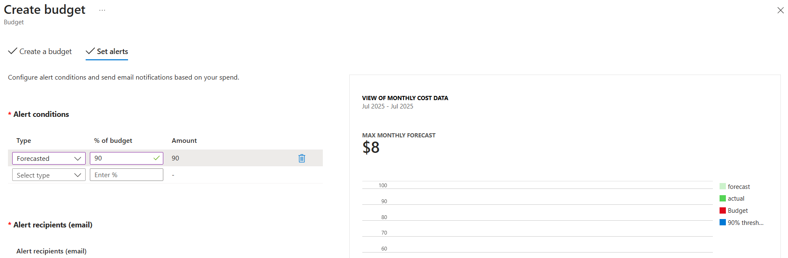
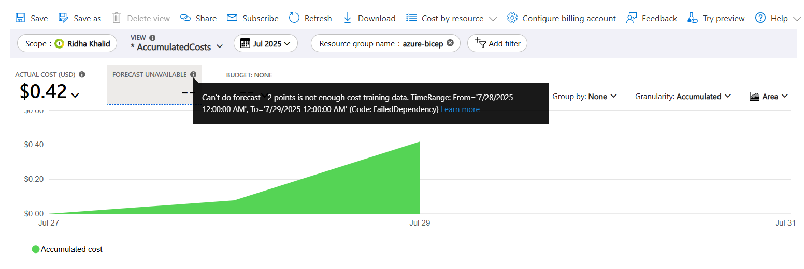
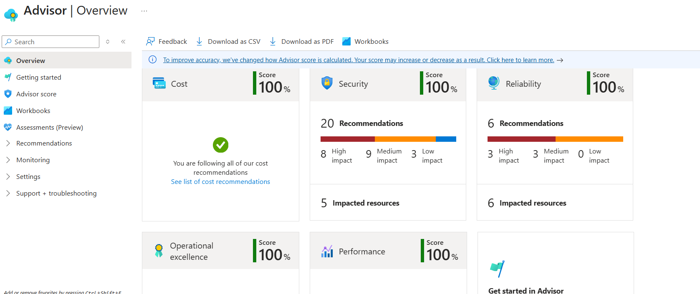

# 💸 Azure Cost Management Setup

Integrated Azure Cost Management to monitor and control resource spending within the deployment project. Configured a budget and explored cost breakdown using native Azure tools.

---

## 📊 Budget Configuration

Created a monthly budget to receive alerts when cost thresholds are breached. This helps ensure that infrastructure remains within defined spending limits.

- **Budget Name:** Azure Bicep Budget
- **Amount:** ₹100 INR
- **Reset Period:** Monthly
- **Alert Threshold:** 90%

---

## 📈 Cost Analysis

Utilized **Cost Analysis** under Azure Cost Management to view the current cost usage by resource group. This provided insights into what services consumed budget and when.

---

## 💡 Azure Advisor

Reviewed cost optimization recommendations from Azure Advisor. 

---

## ✅ Outcome

- Budget alert configured successfully.
- Able to view real-time cost analysis.
- Advisor suggestions used for cost optimization planning.

---

