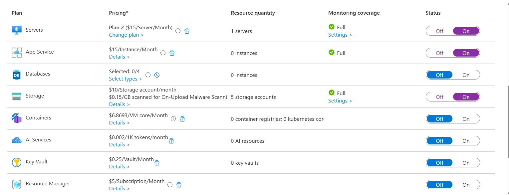
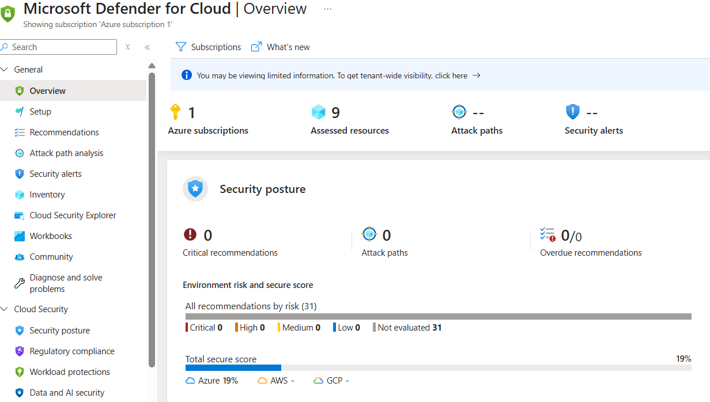

# 🛡️ Microsoft Defender for Cloud

Microsoft Defender for Cloud was configured to monitor threats, assess posture, and provide security recommendations across the Azure environment.

---

## ⚙️ Plans Enabled

Enabled Defender plans at the subscription level to cover core resources like virtual machines, storage, and more. Plans were activated from **Environment Settings > Defender plans**.

---

## 📊 Security Posture Overview

After successful deployment, Defender assessed 9 resources in the environment.

- **Total Secure Score (Azure):** 19%
- **Critical / High / Medium / Low Risk Items:** 0
- **Not Evaluated Resources:** 31
- **Security Alerts / Attack Paths:** None at this stage
  
---

## ✅ Outcome

Microsoft Defender is now enabled and monitoring the deployed infrastructure. The current posture reflects a newly provisioned environment, with most resources still under evaluation. No active threats or alerts were found.
