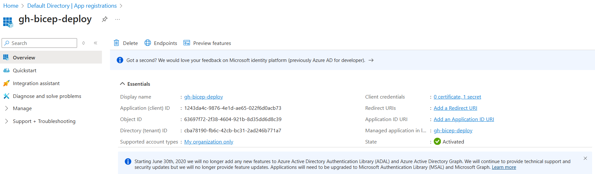
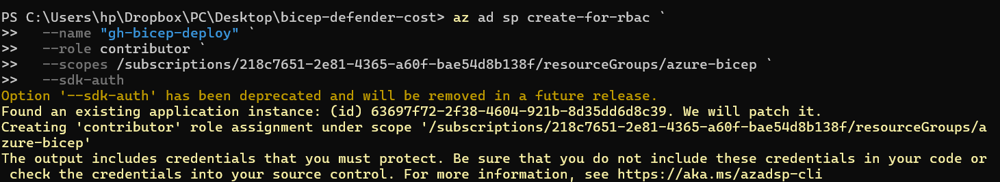
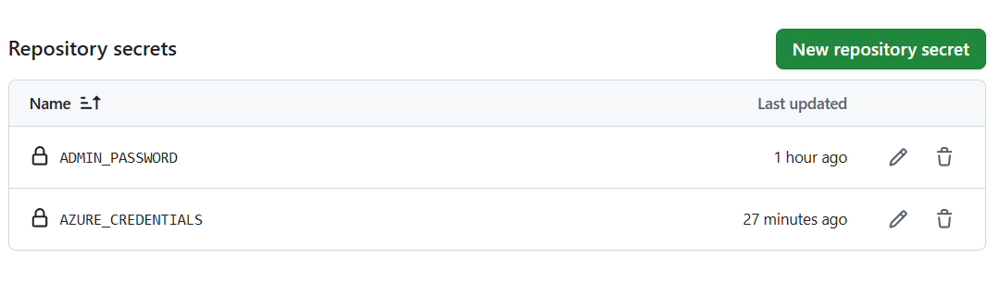
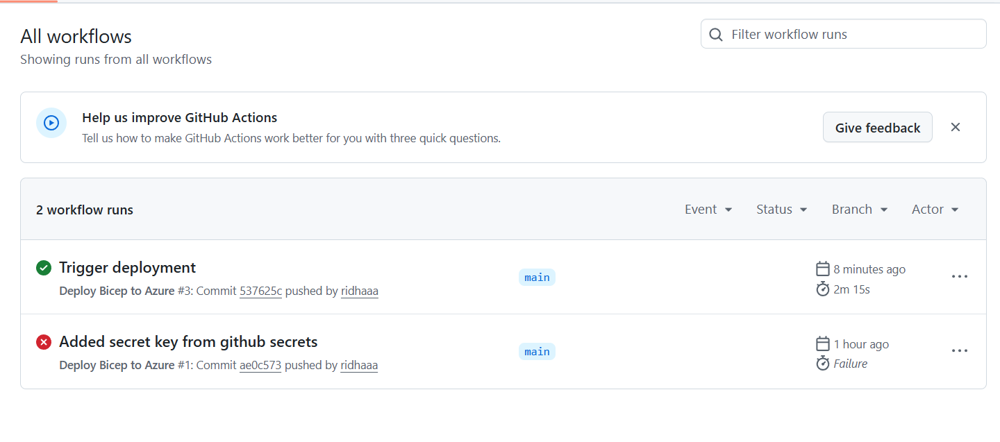
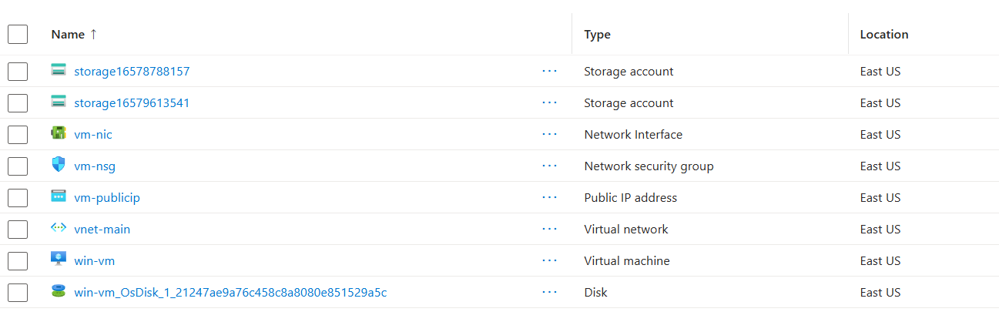

# Azure Bicep Deployment via GitHub Actions  
Provisioned cloud infrastructure using Bicep templates, triggered by GitHub Actions with secure authentication using a Service Principal.

---

## Deployment 
 

---

## Service Principal Authentication  
Created a service principal with contributor access only to the resource group.

- **Command Used:**  
 

Output: JSON credentials securely stored as a GitHub Secret (AZURE_CREDENTIALS)

  ## 🛠️ GitHub Actions Workflow

Set up GitHub Actions to automatically deploy Bicep templates to Azure using a service principal.

- **Workflow Location:** `.github/workflows/deploy.yml`
- **Trigger:** On push to `main` branch
- **Authentication:** Azure Service Principal (`AZURE_CREDENTIALS` stored as GitHub Secret)

### 🔄 Workflow Logic
- Checks out code
- Logs in to Azure via `azure/login` using service principal
- Runs `az deployment group create` to deploy the Bicep template

### ✅ Result
On every push to main, the workflow automatically deploys the latest infrastructure changes to Azure.

Resources are listed in the portal after successful deployment through GitHub Actions

